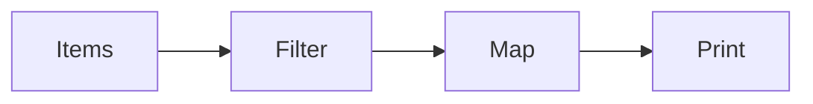
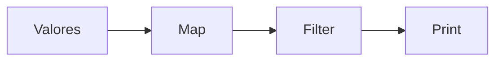

# Taller Individual  2
## Programación reactiva

**Semana**: 11

**Objetivos**:

- Utilizar Flow.Processor para crear funciones de Map y Filter
- Usar rxjava en la construcción de programas reactivos.

### Descripción:

Como usted ya conocen, el lenguaje de programación Java desde la versión 9 tiene soporte nativo para el manejo de reactive streams.

En las siguientes porciones de código usted podrá ver cómo se puede trabajar para crear un programa que dado un flujo de cadenas de texto (*String*) en donde,
se encuentran palabras y números, se hacen los siguientes pasos:

- Filtrar aquellos textos que contienen números
- Transformar los números de texto a enteros y
- Imprimir los números.

Antes de pasar al código es necesario mencionar que debe crear un proyecto Maven con soporte para Java 9 o superior que contenga dos paquetes denominados así:
- Primer paquete: ec.edu.utpl.computacion.pfr.semana11.pe.nativo
- Segundo paquete: ec.edu.utpl.computacion.pfr.semana11.pe.rx

Además su código debe tener la siguiente dependencia, el archivo pom.xml:

```xml
<dependency>
    <groupId>org.apache.commons</groupId>
    <artifactId>commons-lang3</artifactId>
    <version>3.12.0</version>
</dependency>
```

El siguiente código debe ir en el paquete *nativo*.

Comience con la clase que contiene el método principal:

```Java
import org.apache.commons.lang3.StringUtils;

import java.util.List;
import java.util.concurrent.SubmissionPublisher;
import java.util.function.Function;
import java.util.function.Predicate;

public class App {
    public static void main(String[] args) throws InterruptedException {
        SubmissionPublisher<String> publisher = new SubmissionPublisher<>();

        //Crear el subscriber para imprimir
        PrinterSubscriber<Integer> printerSubscriber = new PrinterSubscriber<>();

        //Función convertir de texto a número real
        Function<String, Integer> toDouble = Integer::valueOf;

        //Función filtrar texto que es número
        Predicate<String> predicate = StringUtils::isNumeric;

        //Para filtrar
        FilterProcessor<String, String> onlyNumbersFilter = new FilterProcessor<>(predicate);

        //Para mapear
        MapProcessor<String, Integer> map2IntProcessor = new MapProcessor<>(toDouble);

        //Flujo
        publisher.subscribe(onlyNumbersFilter);
        onlyNumbersFilter.subscribe(map2IntProcessor);
        map2IntProcessor.subscribe(printerSubscriber);


        List<String> items = List.of("100", "Quito", "300", "Loja", "400", "Guayaquil");
        //Enviar los datos a los suscritores
        items.forEach(publisher::submit);

        Thread.sleep(1 * 1000);

        publisher.close();
    }
}
```
Como pudo ver, existen varias clases que se han implementado. Inicie la exploración con la clase que se encarga de imprimir:
```Java
import java.util.concurrent.Flow;

public class PrinterSubscriber<T> implements Flow.Subscriber<T> {
    private Flow.Subscription subscription;

    @Override
    public void onSubscribe(Flow.Subscription subscription) {
        System.out.println("Suscrito");
        this.subscription = subscription;
        this.subscription.request(1);
    }

    @Override
    public void onNext(T item) {
        System.out.printf("Valor: %s\n", item);
        this.subscription.request(1);
    }

    @Override
    public void onError(Throwable throwable) {
        throwable.printStackTrace();
    }

    @Override
    public void onComplete() {
        System.out.println("Todo procesado");
    }
}

```
Lo siguiente a revisar será la clase que se usó para poder filtrar ciertos valores del flujo.

```Java
import java.util.concurrent.Flow;
import java.util.concurrent.SubmissionPublisher;
import java.util.function.Predicate;

public class FilterProcessor<T, R> extends SubmissionPublisher<R>
    implements Flow.Processor<T, R> {

    private Predicate<T> predicate;
    private Flow.Subscription subscription;

    public FilterProcessor(Predicate<T> predicate) {
        this.predicate = predicate;
    }

    @Override
    public void onSubscribe(Flow.Subscription subscription) {
        this.subscription = subscription;
        this.subscription.request(1);
    }

    @Override
    public void onNext(T item) {
        if(predicate.test(item)) {
            submit((R) item);
        }
        this.subscription.request(1);
    }

    @Override
    public void onError(Throwable throwable) {
        throwable.printStackTrace();
    }

    @Override
    public void onComplete() {
        close();
    }
}

```
Finalmente la clase que permite realizar el mapeo:

```Java
import java.util.concurrent.Flow;
import java.util.concurrent.SubmissionPublisher;
import java.util.function.Function;

public class MapProcessor<T, R> extends SubmissionPublisher<R>
    implements Flow.Processor<T, R> {

    private Flow.Subscription subscription;
    private Function function;

    public MapProcessor(Function<? super T, ? extends R> function) {
        this.function = function;
    }

    @Override
    public void onSubscribe(Flow.Subscription subscription) {
        this.subscription = subscription;
        this.subscription.request(1);
    }

    @Override
    public void onNext(T item) {
        submit((R) function.apply(item));
        this.subscription.request(1);
    }

    @Override
    public void onError(Throwable throwable) {
        throwable.printStackTrace();
    }

    @Override
    public void onComplete() { close(); }
}
```

Observe como esas clases usan tipos de datos genéricos, si usted quiere aprender un poco más revise [Generic Types](https://docs.oracle.com/javase/tutorial/java/generics/types.html).

Inclusive se puede llegar a especificar tipos de datos generalizados, así como también especializados *? super T, ? extends R* resspectivamente.

### RxJava

Si bien la implementación nativa funciona y se puede usar sin inconvenientes, es importante conocer alguna librería para Java que permite hacer programación reactiva.

Una librería que tuvo sus orígenes en Netflix es [RxJava](https://github.com/ReactiveX/RxJava) y busca llevar la programación reactiva lenguajes como Java.

Antes de comentar cómo usar esa librería, recuerde que el código debe ir dentro del paquete que se llame *rx*, es decir, trabaje con el mismo proyecto, que creó para el código anterior.

Comience con la dependencia (archivo pom.xml):

```xml
<dependency>
    <groupId>io.reactivex.rxjava3</groupId>
    <artifactId>rxjava</artifactId>
    <version>3.1.5</version>
</dependency>
```
La única clase que necesita es:
```Java
import io.reactivex.rxjava3.core.Observable;
import org.apache.commons.lang3.StringUtils;
import java.util.List;

public class App {
    public static void main(String[] args) throws InterruptedException {
        List<String> items = List.of("100", "Quito", "300", "Loja", "400", "Guayaquil");
            Observable.fromIterable(items)
            .filter(StringUtils::isNumeric)
            .map(Integer::valueOf)
            .subscribe(System.out::println);

        Thread.sleep(1 * 1000);
    }
}
```
Mucho más sencillo ¿no es vedad?

El flujo que acabó de construir en ambos programas se puede resumir así:



### Actividad a realizar

Ahora que conoce dos formas de trabajo para reactive streams debe realizar dos implementaciones (1 nativo (re-use las clases existentes) y 1 rxjava) para implementar el siguiente flujo:



Los valores que son generados por el flujo están compuestos de la siguiente forma: DEVICE_ID:VALUE. Aquí un ejemplo:
List.of("TERM_1:22", "TERM_2:36", "TERM_3:19.7", "TERM_4:28.1", "TERM_5:22")

Usted debe mapear los datos anteriores para quedarse únicamente con el valor (VALUE), para luego filtrar aquellos valores que son mayores a 21.0 y finalmente imprimirlos.


### Calificación:

Para la calificación, se debe presentar el trabajo realizado a su tutor.

Tal como se le explicó anteriormente, los talleres se calificarán de la siguiente manera:
- 10 puntos si presenta en el horario de prácticas y experimentación.
- 7 puntos presenta en el horario de tutoría
- 0 para quienes no presentan.